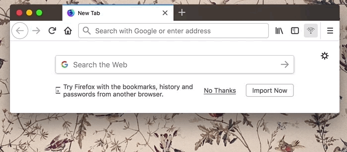

# libdweb

[![travis][travis.icon]][travis.url]
[![package][version.icon] ![downloads][downloads.icon]][package.url]
[![styled with prettier][prettier.icon]][prettier.url]

This repositiory hosts a community effort to implement [experimental APIs][webextension experiments] for Firefox WebExtensions with a goal of enabling dweb protocols in Firefox through browser add-ons. The long term goal of this project is to integrate these APIs into the [WebExtensions][new apis] ecosystem.

## Participation

You can help this effort in following ways:

1. Use these APIs to make something illustrating its value, to build the case for adoption in the core WebExtension API set.
2. Get involved in driving this effort: Help with an API implementation, maintenance, testing, code samples, etc.
3. Help build [API adapters][api-adapters] to enable seamless integration with existing libraries.
4. Join our IRC channel: #dweb on irc.mozilla.org

## Status: In active development

| API                   | Status |
| --------------------- | ------ |
| [Protocol Handler][]  | 🐥     |
| [Service Discovery][] | 🐣     |
| [File System][]       | 🐣     |
| [UDP Socket][]        | 🐣     |
| [TCP Socket][]        | 🐣     |

- 🥚 : In design phase
- 🐣 : Work in progress
- 🐥 : Try it out
- 🐓 : Usable

## API overview

**Note:** You can try all the examples after you've cloned the repo and got the toolchain setup by running `npm install`. You will also need [Firefox Nightly][] to run the demos.

### Protocol API

The Protocol API allows you to handle custom protocols from your Firefox extension. This is different from the existing [WebExtensions protocol handler API][webextensions protocol_handlers] in that it does not register a website for handling corresponding URLs but rather allows your WebExtension to implement the handler.

The following example implements a simple `dweb://` protocol. When firefox is navigated to `dweb://hello/world`, for example, it will invoke your registered handler and pass it a `request` object containing request URL as `request.url` string property. Your handler is expected to return a repsonse with a `content` that is [async iterator][] of [`ArrayBuffer`][]s. In our example we use a `respond` [async generator][] function to respond with some HTML markup.

```js
browser.protocol.registerProtocol("dweb", request => {
  return {
    contentType: "text/html",
    content: respond(request.url)
  }
})

async function* respond(text) {
  const encoder = new TextEncoder("utf-8")
  yield encoder.encode("<h1>Hi there!</h1>\n").buffer
  yield encoder.encode(
    `<p>You've succesfully loaded <strong>${request.url}</strong><p>`
  ).buffer
}
```

Given that `response.content` is an [async iterator][] it is also possible to stream response content as this next example illustrates.

```js
browser.protocol.registerProtocol("dweb", request => {
  switch (request.url) {
    case "dweb://stream/": {
      return {
        contentType: "text/html",
        content: streamRespond(request)
      }
    }
    default: {
      return {
        contentType: "text/html",
        content: respond(request.url)
      }
    }
  }
})

async function* streamRespond(request) {
  const encoder = new TextEncoder("utf-8")
  yield encoder.encode("<h1>Say Hi to endless stream!</h1>\n").buffer
  let n = 0
  while (true) {
    await new Promise(resolve => setTimeout(resolve, 1000))
    yield encoder.encode(`<p>Chunk #${++n}<p>`).buffer
  }
}
```

You can see the demo of the example above in [Firefox Nightly][] by running following command, and then navigating to [dweb://hello/world](dweb://hello/world) or [dweb://stream/](dweb://stream/)

```
npm run demo:protocol
```


### Service Discovery API

API provides DNS-Based Service Discovery API as per [rfc6763][]. Following example illustrates how this API can be used to discover available `http` services in the network.

```js
void (async () => {
  const services = browser.ServiceDiscovery.discover({
    type: "dweb",
    protocol: "tcp" // Must be "tcp" or "udp"
  })

  console.log("Start discovery", services.query)
  for await (const service of services) {
    if (service.lost) {
      console.log("Lost service", service)
    } else {
      console.log("Found service", {
        name: service.name,
        type: service.type,
        protocol: service.protocol
      })

      for (const {
        address,
        port,
        host,
        attributes
      } of await service.addresses()) {
        console.log(
          `Service ${service.name} available at ${host} ${address}:${port}`,
          attributes
        )
      }
    }
  }
  console.log("End discovery", services.query)
})()
```

API also allows you to announce service that others on the network can discover. Following example illustrates that:

```js
void (async () => {
  const service = await browser.ServiceDiscovery.announce({
    name: "My dweb service",
    type: "dweb",
    protocol: "tcp", // must be "tcp" or "udp"
    port: 3000, // ommting port will just assign you available one.
    attributes: {
      // optional txt records
      version: "1.0."
    }
  })

  console.log("Service annouced", {
    name: service.name, // Note: Colud be different like "My dweb service (2)"
    type: service.type,
    protocol: service.protocol,
    port: service.port,
    attributes: service.attributes // Will be null if was omitted
  })

  // Wait for a 1 minute and expire service announcement
  await new Promise(timeout => setTimeout(timeout, 60 * 1000))
  await service.expire()
  console.log(`Service expired`)
})()
```

#### Demo

You can try demo WebExtension that displays discovers and displayes `http`
services in your local network when button in the toolbar is clicked. You can
run it in [Firefox Nightly][] via following command

```
npm run demo:discovery
```



### FileSystem API

FileSystem API provides access to an OS file system, but restricted to a user chosen directory. Below example illustrates writing a content to a file in user chosen directory.

```js
void (async () => {
  const volume = await browser.FileSystem.mount({
    read: true,
    write: true
  })
  console.log("Mounted", volume)
  localStorage.setItem("volumeURL", volume.url)

  const fileURL = new URL("hello.md", volume.url).href
  const encoder = new TextEncoder()
  const content = encoder.encode("# Hello World\n").buffer
  const size = await browser.FileSystem.writeFile(fileURL, content)
  console.log(`Wrote ${size} bytes to ${fileURL}`)
})()
```

Call to `FileSystem.mount` will notify user that corresponding WebExtension is requesting `read / write` access to the file system, which user can deny or grant by choosing a directory. If user denies to access then promise returned by `mount` will be rejected, if user chooses to grant access to a speicific directory promise will resolve to an object like.

```js
{
  url:"file:///Users/user/dweb/",
  readable:true,
  writable:true
}
```

The rest of the example that writes content into a file should be pretty stright forward.

> **Note:** Granted access is be preserved across sessions, and WebExtension could mount same directory without prompting a user again.

Following is more complete example that will either mount directory that user has already granted access to or request access to new directory otherwise.

```js
void (async () => {
  const url = localStorage.getItem("volumeURL")
  const volume = await browser.FileSystem.mount({ url, read: true })

  const fileURL = new URL("hello.md", volume.url).href
  const file = await browser.FileSystem.open(fileURL, { read: true })
  const chunk = await browser.File.read(file, { position: 2, size: 5 })
  console.log(`Read file fragment from ${fileURL}`, chunk)
  const decoder = new TextDecoder()
  const content = decoder.decode(chunk)
  console.log(`Decode read fragment`, content)
  await browser.File.close(file)
})()
```

> **Note:** Attempt to mount a URL that user has not previously granted access to will fail without even prompting a user.

FileSystem API has many other functions available you can follow the links for detailed API interface definitions of [`browser.FileSystem`][] and [`browser.File`][]

You can try demo WebExtension that provides a [REPL][] in the sidebar exposing all of the FileSystem API, which you can run in [Firefox Nightly][] via following command

> **Note:** Commands recognized by [REPL][] correspond to the API functions names and all the parameters are names prefixed by `--` and followed by value.

```
npm run demo:fs
```


### UDPSocket API

API provides an implementation of UDP Datagram sockets. Follow the link for detailed API interface for [`browser.UDPSocket`][] which corresponds to `UDPSocketManager`.

There is also a [@libdweb/dgram-adapter][] project that provides [nodejs dgram][] API adapter.

#### Example

Following example opens UDP socket on port `41234` that will act as a server and will continuously print incoming messages.

```js
void (async () => {
  const server = await browser.UDPSocket.create({
    port: 41234
  })
  console.log(`listening ${server.address.host}:${server.address.port}`)

  const decoder = new TextDecoder()
  for await (const { from, data } of browser.UDPSocket.messages(server)) {
    console.log(`receive message`)
    const message = decoder.decode(data)
    console.log(`server got: ${message} from ${from.host}:${from.port}`)
  }
})()
```

> **Note:** Incoming messages are represented via [async iterator][] which can be consumed via `for await`, but be aware that **messages are not buffered** so if you use `await` inside the `for await` block chances are you will miss message which will be dropped.

Following example opens socket on arbitrary port and then sends a message to the server socket from the above example.

```js
void (async () => {
  const client = await browser.UDPSocket.create({ host: "127.0.0.1" })
  console.log(`opened socket ${client.address.host}:${client.address.port}`)
  const encoder = new TextEncoder()
  const message = encoder.encode("Hello UDP").buffer
  await browser.UDPSocket.send(client, "127.0.0.1", 41234, message)
})()
```

> **Note**: UDPSocket API unlike one in nodejs is not going to resolve hostnames like `"localhost"`. You need to use WebExtensions [dns][webextensions dns] API to resolve hostnames.

#### Demo

You can try demo WebExtension that provides a [REPL][] in the sidebar exposing all of the UDPSocket API, which you can run in [Firefox Nightly][] via following command

> **Note:** Commands recognized by [REPL][] correspond to the API functions names and all the parameters are names prefixed by `--` and followed by corresponding values.

```
npm run demo:dgram
```

### TCPSocket API

TCPSocket API provides a client and server socket APIs for [TCP][] networking.

#### Example

Following example starts echo TCP server on port `8090`. It will accept incoming
connections read first chunk of data, respond by echoing messages back to.

```js
void (async () => {
  const encoder = new TextEncoder()
  const decoder = new TextDecoder()

  const server = await browser.TCPSocket.listen({ port: 8090 })
  console.log("Started TCP Server", server)

  const onconnect = async client => {
    console.log("Client connected:", client)
    const message = await client.read()
    console.log("Received message from client:", decoder.decode(message))
    const response = encoder.encode(`<echo>${decoder.decode(message)}</echo>`)
    await client.write(response.buffer)
  }

  for await (const client of server.connections) {
    onconnect(client)
  }
})()
```

> **Note:** `server.connections` are represented via [async iterator][] which can be consumed via `for await`, but be aware that connections are **not buffered** which is why handle each connection in `onconnect` function so our server can accept more connections. If you use `await` inside the `for await` block chances are you will miss connection, in which case it will be automatically closed.

Following example connects to server from the example above writes a message to it and then reads message received back.

```js
void (async () => {
  const encoder = new TextEncoder()
  const decoder = new TextDecoder()

  const client = await browser.TCPSocket.connect({
    host: "localhost",
    port: 8090
  })
  await client.opened
  console.log("Client connected:", client)

  await client.write(encoder.encode("Hello TCP").buffer)
  const response = await client.read()
  console.log("Received response:", decoder.decode(response))
})()
```

[travis.icon]: https://travis-ci.org/mozilla/libdweb.svg?branch=master
[travis.url]: https://travis-ci.org/mozilla/libdweb
[version.icon]: https://img.shields.io/npm/v/libdweb.svg
[downloads.icon]: https://img.shields.io/npm/dm/libdweb.svg
[package.url]: https://npmjs.org/package/libdweb
[downloads.image]: https://img.shields.io/npm/dm/libdweb.svg
[downloads.url]: https://npmjs.org/package/libdweb
[prettier.icon]: https://img.shields.io/badge/styled_with-prettier-ff69b4.svg
[prettier.url]: https://github.com/prettier/prettier
[webextension experiments]: https://webextensions-experiments.readthedocs.io/en/latest/index.html
[new apis]: https://wiki.mozilla.org/WebExtensions/NewAPIs
[protocol handler]: https://github.com/mozilla/libdweb/issues/2
[udp socket]: https://github.com/mozilla/libdweb/issues/4
[tcp socket]: https://github.com/mozilla/libdweb/issues/5
[µtp socket]: https://github.com/mozilla/libdweb/issues/6
[service discovery]: https://github.com/mozilla/libdweb/issues/7
[file system]: https://github.com/mozilla/libdweb/issues/8
[web-ext]: https://www.npmjs.com/package/web-ext
[firefox nightly]: https://blog.nightly.mozilla.org/
[api-adapters]: https://github.com/libdweb
[webextensions protocol_handlers]: https://developer.mozilla.org/en-US/Add-ons/WebExtensions/manifest.json/protocol_handlers
[async iterator]: https://github.com/tc39/proposal-async-iteration#async-iterators-and-async-iterables
[`arraybuffer`]: https://developer.mozilla.org/en-US/docs/Web/JavaScript/Reference/Global_Objects/ArrayBuffer
[async generator]: https://github.com/tc39/proposal-async-iteration#async-generator-functions
[`browser.filesystem`]: https://github.com/mozilla/libdweb/blob/master/src/FileSystem/FileSystem.js#L8-L39
[`browser.file`]: https://github.com/mozilla/libdweb/blob/master/src/FileSystem/FileSystem.js#L41-L51
[repl]: https://en.wikipedia.org/wiki/Read%E2%80%93eval%E2%80%93print_loop
[`browser.udpsocket`]: https://github.com/mozilla/libdweb/blob/master/src/UDPSocket/UDPSocket.js
[webextensions dns]: https://developer.mozilla.org/en-US/Add-ons/WebExtensions/API/dns
[@libdweb/dgram-adapter]: https://github.com/libdweb/dgram-adapter
[nodejs dgram]: https://nodejs.org/api/dgram.html
[tcp]: https://en.wikipedia.org/wiki/Transmission_Control_Protocol
[rfc6763]: https://tools.ietf.org/html/rfc6763
